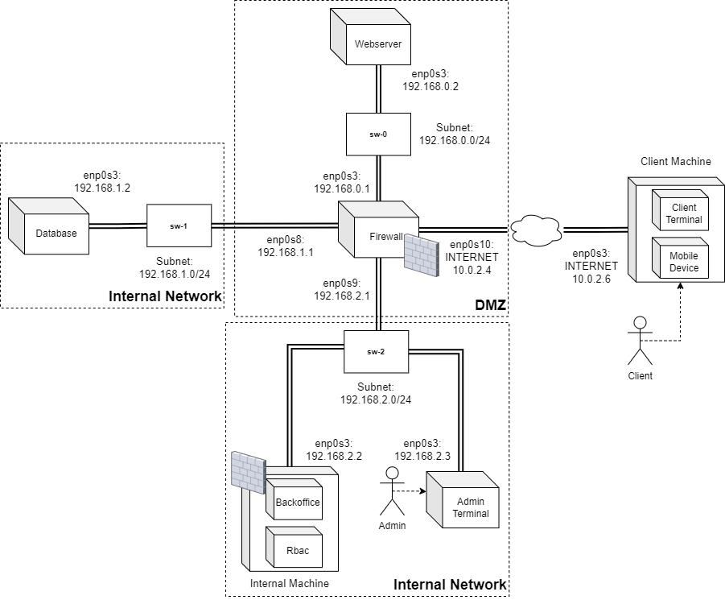

Instituto Superior Técnico

Master's Degree in Computer Science and Engineering

Network and Computer Security 2022/2023

# EcoGes

This project aims to develop a new system for the Electricity provider, which allows clients to have a minute-by-minute update on their energy consumption and production. With this new system, the user can monitor the energy cost of every household appliance or how much energy the solar panels produce by logging into the EcoGes website. The system is also used to manage every user's contract and calculate the monthly invoices regarding the consumed energy, the energy plan (flat rate or bi-hourly rate), and taxes.

The EcoGes application concerns a five-tier system:
- A set of clients that can access EcoGes through a public website.
- A public website for clients to access energy consumption information and update their personal data.
- An internal private back office where employees of EcoGes can manage the system according to their role in the company (marketing, account manager, technical assistant, or system manager).
- A set of internal machines where employees can access the back office.
- A database server to store persistent information regarding clients and the organization’s internal data.

# Technology Used
- Java programming language
- gRPC: framework of remote procedure calls that supports client and server communication
- Maven: build automation tool for Java projects
- Protobuf: cross-platform data used to serialize structured data
- JUnit: unit testing framework for Java programming language

# Requirements

- Java Developer Kit 19 (JDK 19)
- Maven 3
- MySQL

Install:

    sudo apt update
    sudo apt install mysql-server
    sudo apt install maven

Confirm all versions are correctly installed:

    javac -version
    mvn -version
    mysql -v

# Configure Network and Firewall

All machines will be running on Linux and configured according to the following figure and table:

| # Interface | Subnet | Adapter | Adapter Attached To | Adapter Name |
|:---:|:---:|:---:|:---:|:---:|
| __Client Machine__ |||||||||
| 1 | INTERNET (10.0.2.6) | enp0s3 | NatNetwork |  |
| __Firewall Machine__ |
| 1 | INTERNET (10.0.2.4) | enp0s3 | NatNetwork |  |
| 2 | 192.168.0.1 | enp0s3 | Internal Network | sw-0
| 3 | 192.168.1.1 | enp0s8 | Internal Network | sw-1
| 4 | 192.168.2.1 | enp0s9 | Internal Network | sw-2
| __Webserver Machine__ |
| 1 | 192.168.0.2 | enp0s3 | Internal Network | sw-0
| __Database Machine__ |
| 1 | 192.168.1.2 | enp0s3 | Internal Network | sw-1
| __Backoffice Machine__ |
| 1 | 192.168.2.2 | enp0s3 | Internal Network | sw-2
| __Admin Machine__ |
| 1 | 192.168.2.2 | enp0s3 | Internal Network | sw-2

For each machine, run the following commands:

    cd ecoges/scripts
    chmod 777 <script>.sh

> **TIP: If the script does not run as expected, convert the file to unix format using the `dos2unix` tool and run the script again**
>
>    \> **`dos2unix <script>.sh`**

Firewall machine:
    
    sudo ./firewall.sh

Webserver machine:

    sudo ./webserver.sh

Backoffice machine:

    sudo ./backoffice.sh

Database machine:

    sudo ./db.sh

Admin machine:

    sudo ./terminal.sh

# Generate Certificates

Before deploying all machines, you need to generate the certificates that will be used for TLS connections and the departments.

For the TLS, both webserver, backoffice and database ceritificates need to be issued to their IP address.

Change the field `IP.1` in `ecoges/scripts/webserver-domains.ext` to the corresponding IP address (e.g. Firewall public IP `10.0.2.4`)
 
    IP.1 = 10.0.2.4

Change the field `IP.1` in `ecoges/scripts/backoffice-domains.ext` to the corresponding IP address (e.g. `192.168.2.2`)

    IP.1 = 192.168.2.2

Change the field `IP.1` in `ecoges/scripts/database-domains.ext` to the corresponding IP address (e.g. `192.168.1.2`)

    IP.1 = 192.168.1.2

To generate the certificates, simply run the script:

> **TIP: If the script does not run as expected, convert the file to unix format using the `dos2unix` tool and run the script again**
>
>    \> **`dos2unix generateCertificates.sh`**

    cd ecoges/scripts
    ./generateCertificates.sh

# Set Up Database

Add `clientdb` schema:

    sudo mysql
        DROP DATABASE IF EXISTS clientdb;
        CREATE DATABASE clientdb;

Add symmetric encryption mechanism:

        install plugin keyring_file soname 'keyring_file.so';
        show variables like '%keyring%';

Later, when the system is running, we can verify that the database tables are encrypted using:

        SELECT TABLE_SCHEMA, TABLE_NAME, CREATE_OPTIONS FROM INFORMATION_SCHEMA.TABLES WHERE CREATE_OPTIONS LIKE '%ENCRYPTION%';

Note that the master encryption key should be rotated periodically and whenever you suspect that the key has been compromised using:

        ALTER INSTANCE ROTATE INNODB MASTER KEY;

Create an user for webserver and backoffice with hosts `192.168.0.2` and `192.168.2.2`, respectively (alternatively, can use `localhost` during development) and add privileges:

        CREATE USER 'ecoges'@'192.168.0.2' IDENTIFIED BY 'admin';
        GRANT ALL PRIVILEGES ON clientdb.* TO 'ecoges'@'192.168.0.2';

        CREATE USER 'ecoges'@'192.168.2.2' IDENTIFIED BY 'admin';
        GRANT ALL PRIVILEGES ON clientdb.* TO 'ecoges'@'192.168.2.2';

Change `bind-address` field to desired `<databaseHost>` of database (e.g. `192.168.1.2`):

    exit
    sudo vim /etc/mysql/mysql.conf.d/mysqld.cnf
        bind-address = 192.168.1.2

To configure TLS, copy keys and certificates:

    cd SIRS/ecoges
    sudo mkdir /etc/mysql/tlscerts
    sudo cp tlscerts/ca.crt /etc/mysql/tlscerts/ca.crt
    sudo cp tlscerts/database.crt /etc/mysql/tlscerts/database.crt
    sudo cp tlscerts/database.key /etc/mysql/tlscerts/database.key

> **TIP: make sure these keys and certificates have root permissions, otherwise, MySQL won't be able to use SSL!**
>
>    \> **`chmod 777 /etc/mysql/tlscerts/ca.crt`**
>    \> **`chmod 777 /etc/mysql/tlscerts/database.crt`**
>    \> **`chmod 777 /etc/mysql/tlscerts/database.key`**

Append the following content to `/etc/mysql/my.cnf` file:

    sudo vim /etc/mysql/my.cnf
        [mysqld]
        ssl=1
        ssl-cipher=DHE-RSA-AES256-SHA
        ssl-ca=/etc/mysql/tlscerts/ca.crt
        ssl-cert=/etc/mysql/tlscerts/database.crt
        ssl-key=/etc/mysql/tlscerts/database.key

Verify if everything is ok, having the following field values: `have_openssl` = `YES`:

    sudo service mysql restart
    sudo mysql
        show variables like '%ssl%';
    exit

Generate the database tables using the SQL script:

    cd ecoges/scripts
    sudo mysql
        source createDatabaseTables.sql
    exit

# Compile and Run

For each machine, compile and run the project:

    cd ecoges
    mvn clean compile install -DskipTests

Run webserver on port `<serverPort>` (e.g. `8000`) and communicate with database on `<databaseHost>` (e.g. `localhost` for development or `192.168.1.2`) with port `<databasePort>` (e.g. `3306`):

    cd ecoges/webserver
    mvn exec:java -Dexec.args="8000 192.168.1.2 3306"

Run client to communicate with webserver on `<serverHost>` (e.g. `localhost` for development; firewall public IP `10.0.2.4`) and port `<serverPort>` (e.g. `8000`):

    cd ecoges/client
    mvn exec:java -Dexec.args="10.0.2.4 8000"

Run backoffice on port `<serverPort>` (e.g. `8001`) and communicate with database on `<databaseHost>` (e.g. `localhost` for development or `192.168.1.2`) with port `<databasePort>` (e.g. `3306`):

    cd ecoges/backoffice
    mvn exec:java -Dexec.args="8000 192.168.1.2 3306"

Run admin to communicate with backoffice on `<serverHost>` (e.g. `localhost` for development; `192.168.2.2`) and port `<serverPort>` (e.g. `8001`):

    cd ecoges/admin
    mvn exec:java -Dexec.args="192.168.2.2 8001"